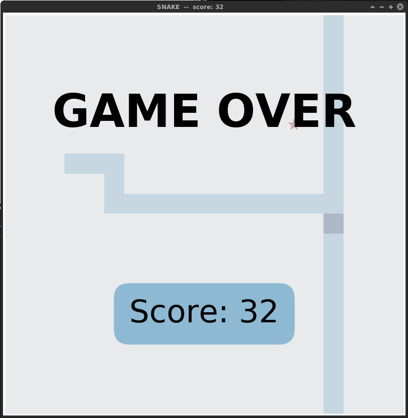

# Snake in matplotlib

### Implementation of the [snake game](https://en.wikipedia.org/wiki/Snake_(video_game_genre)) using [matplotlib](https://matplotlib.org/). The point is to show that the display and interactive features of matplotlib can be used for a simple video game loop.

#### Screenshots:

 

###### dependencies: python3, matplotlib
